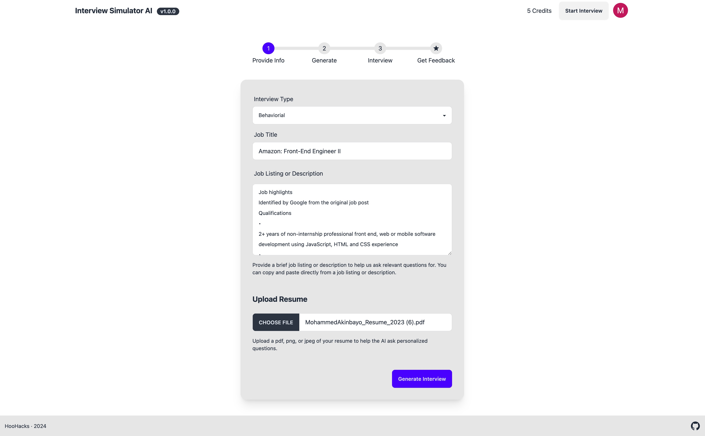
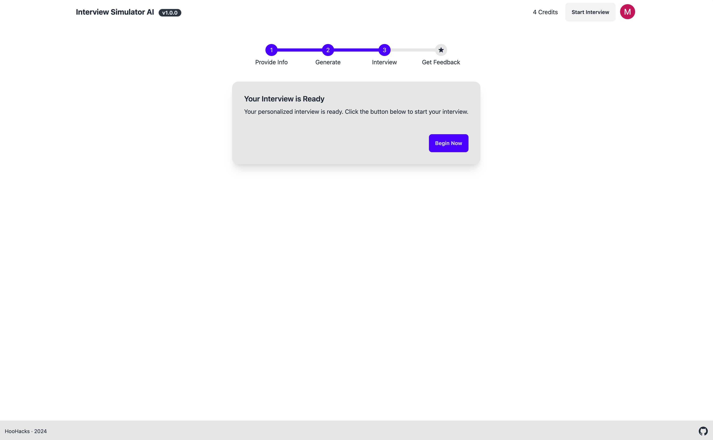
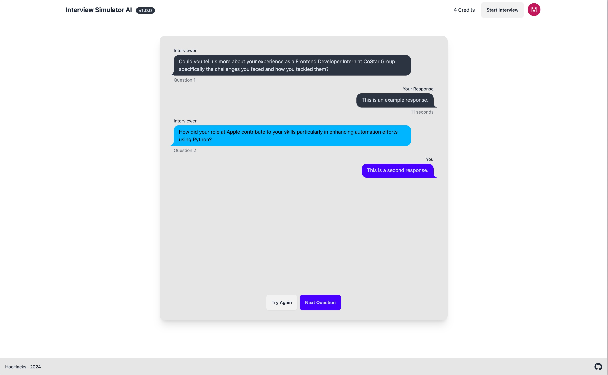
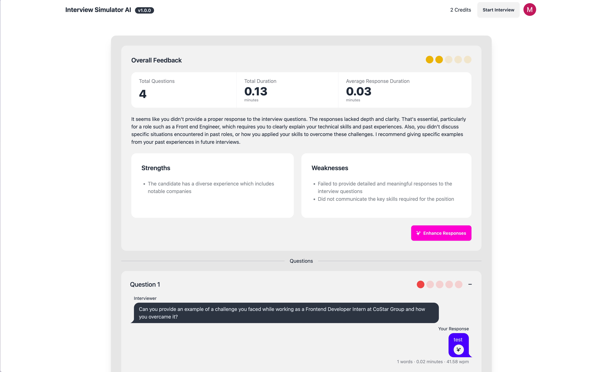

# Proficio AI

**Master your next job interview with AI!**

Proficio (Latin): to make progress, advance, succeed, or be proficient.

Proficio AI is a cutting-edge web application designed to help users excel in job interviews through personalized feedback and tailored interview experiences. By leveraging advanced technologies such as OpenAI GPT-4 and Amazon Textract, Proficio AI offers users the opportunity to upload their resumes, input job descriptions, and immerse themselves in realistic interview simulations. With instant feedback and guidance, users can refine their responses and make a stellar impression every time!

## Tech Stack

- **Frontend**: React
- **Backend**: AWS (Amazon Web Services)
- **NLP Engine**: Whisper, OpenAI GPT-4
- **Document Analysis**: Amazon Textract

## Features
- Personalized Interview Questions
- Detailed Feedback and Analytics
- Speech-to-Text Technology
- Multi-Language Support

## Additional Details

Proficio AI was developed as part of the 2024 HooHack Hackathon, where our team aimed to create a solution that empowers individuals in their career advancement journey. By combining state-of-the-art AI technologies with intuitive user experience, Proficio AI aims to revolutionize the way job seekers prepare for and approach interviews.

## Unimplemented Features

Due to the time constraints, there were many features designed and constructed, but to allow for a clean final product, these features had to have been dropped. We still want to showcase these features, as a possible future implementation:

### Code Interview

Along with training with verbal responses, there was also a feature for the user to practice coding common interview questions based on the job posting. The user would get a detailed report on how they did, where they could do better, and common practices

### Enhanced Response

A premium feature we were considering were Enhanced Response, where the user could spend more credits to get an even more indepth response.

## Contributers

- **Milo Schwartz**: [Github](https://github.com/miloschwartz)  [LinkedIn](https://www.linkedin.com/in/miloaschwartz/) 
- **Lucas Kohler**: [Github](https://github.com/ldkohler)  [LinkedIn](https://www.linkedin.com/in/lucas-d-kohler/)
- **Barrett Ruth**: [Github](https://github.com/barrett-ruth)  [LinkedIn](https://www.linkedin.com/in/barrett-ruth/)
- **Mohammed Akinbayo**: [Github](https://github.com/Mohammed532)  [LinkedIn](https://www.linkedin.com/in/mohammed-akinbayo/)

